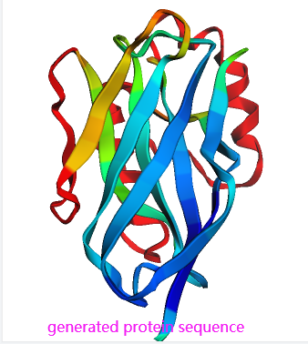

<!-- </img> -->

## Denoising Diffusion Probabilistic Model For Protein Sequence Generation

Implementation of a proof of concept (POC) that leverages <a href="https://arxiv.org/abs/2006.11239">Denoising Diffusion Probabilistic Model</a> to generate protein sequences. Code is implemented in pytorch.


This implementation of DDPM was transcribed from lucidrains <a href="https://github.com/lucidrains/denoising-diffusion-pytorch">here</a>
I replace the UNet with a pre-trained protein language model ESM-2 for the denoising part.



## Install

```bash
$ git clone https://github.com/pengzhangzhi/denoising-diffusion-protein-sequence
```
```bash
cd denoising_diffusion_protein_sequence
```
Install this package
```bash
pip install .
```
Install esm to get the language model. The esm is hacked for this project. The original esm see [here](https://github.com/facebookresearch/esm).
```bash
cd esm
```

```bash
pip install .
```

## Sampling Protein Sequences

```bash
cd denoising_diffusion_pytorch
```
Use pretrained model in `denoising_diffusion_pytorch/experiment/best-v1.ckpt`  to sample novel protein sequences.

```
python sample.py
```
Results will be saved in `denoising_diffusion_pytorch/generated_protein_seqs.fasta`.


## Training

I use pytorch-lighning to train the denosing diffusion model. Command line arguments can be passed to manipulate the training, details see `denoising_diffusion_pytorch/add_args.py`.
```bash
cd denoising_diffusion_pytorch
```

```bash
python pl_train.py 
```


## Citations

```bibtex
@inproceedings{NEURIPS2020_4c5bcfec,
    author      = {Ho, Jonathan and Jain, Ajay and Abbeel, Pieter},
    booktitle   = {Advances in Neural Information Processing Systems},
    editor      = {H. Larochelle and M. Ranzato and R. Hadsell and M.F. Balcan and H. Lin},
    pages       = {6840--6851},
    publisher   = {Curran Associates, Inc.},
    title       = {Denoising Diffusion Probabilistic Models},
    url         = {https://proceedings.neurips.cc/paper/2020/file/4c5bcfec8584af0d967f1ab10179ca4b-Paper.pdf},
    volume      = {33},
    year        = {2020}
}
```

```bibtex
@InProceedings{pmlr-v139-nichol21a,
    title       = {Improved Denoising Diffusion Probabilistic Models},
    author      = {Nichol, Alexander Quinn and Dhariwal, Prafulla},
    booktitle   = {Proceedings of the 38th International Conference on Machine Learning},
    pages       = {8162--8171},
    year        = {2021},
    editor      = {Meila, Marina and Zhang, Tong},
    volume      = {139},
    series      = {Proceedings of Machine Learning Research},
    month       = {18--24 Jul},
    publisher   = {PMLR},
    pdf         = {http://proceedings.mlr.press/v139/nichol21a/nichol21a.pdf},
    url         = {https://proceedings.mlr.press/v139/nichol21a.html},
}
```

```bibtex
@inproceedings{kingma2021on,
    title       = {On Density Estimation with Diffusion Models},
    author      = {Diederik P Kingma and Tim Salimans and Ben Poole and Jonathan Ho},
    booktitle   = {Advances in Neural Information Processing Systems},
    editor      = {A. Beygelzimer and Y. Dauphin and P. Liang and J. Wortman Vaughan},
    year        = {2021},
    url         = {https://openreview.net/forum?id=2LdBqxc1Yv}
}
```

```bibtex
@article{Choi2022PerceptionPT,
    title   = {Perception Prioritized Training of Diffusion Models},
    author  = {Jooyoung Choi and Jungbeom Lee and Chaehun Shin and Sungwon Kim and Hyunwoo J. Kim and Sung-Hoon Yoon},
    journal = {ArXiv},
    year    = {2022},
    volume  = {abs/2204.00227}
}
```

```bibtex
@article{Karras2022ElucidatingTD,
    title   = {Elucidating the Design Space of Diffusion-Based Generative Models},
    author  = {Tero Karras and Miika Aittala and Timo Aila and Samuli Laine},
    journal = {ArXiv},
    year    = {2022},
    volume  = {abs/2206.00364}
}
```

```bibtex
@article{Song2021DenoisingDI,
    title   = {Denoising Diffusion Implicit Models},
    author  = {Jiaming Song and Chenlin Meng and Stefano Ermon},
    journal = {ArXiv},
    year    = {2021},
    volume  = {abs/2010.02502}
}
```

```bibtex
@misc{chen2022analog,
    title   = {Analog Bits: Generating Discrete Data using Diffusion Models with Self-Conditioning},
    author  = {Ting Chen and Ruixiang Zhang and Geoffrey Hinton},
    year    = {2022},
    eprint  = {2208.04202},
    archivePrefix = {arXiv},
    primaryClass = {cs.CV}
}
```

```bibtex
@article{Qiao2019WeightS,
    title   = {Weight Standardization},
    author  = {Siyuan Qiao and Huiyu Wang and Chenxi Liu and Wei Shen and Alan Loddon Yuille},
    journal = {ArXiv},
    year    = {2019},
    volume  = {abs/1903.10520}
}
```
